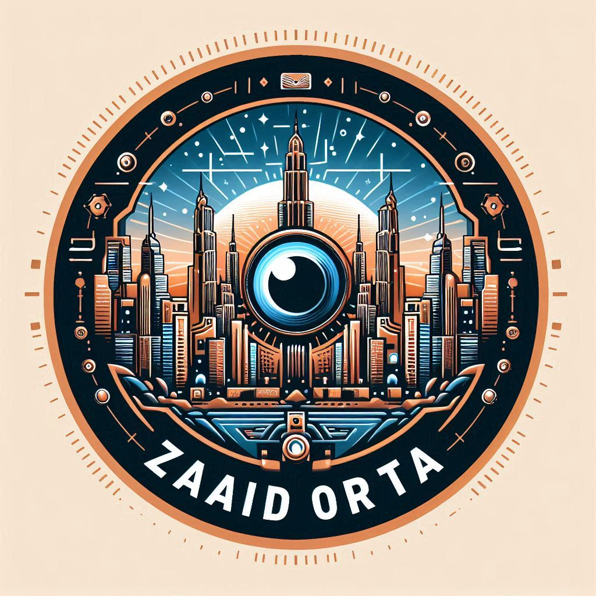

# 🧑🏻‍💻 About Me:
👋 ¡Hola! Soy estudiante de la Licenciatura en Ingeniería en Computación en la Universidad Autónoma del Estado de México (CU Valle de México), con formación técnica en programación. Me apasiona la tecnología, en especial la resolución de problemas a través del desarrollo de software. Estoy comprometido con el aprendizaje continuo y la colaboración en proyectos innovadores que impulsen el avance tecnológico.

⚙️ **Tecnologías y Herramientas:**
- **Lenguajes:** Java, Python, JavaScript, HTML
- **Frameworks y Librerías:** p5.js, NodeJS

📚 **Áreas de Interés:**
- Ciencia de Datos y Big Data
- Desarrollo de Software
- Redes

💡 Si deseas conocer más sobre mi trabajo, ¡te invito a visitar mi sitio web!

  

## 🌐 Socials:
  

# 💻 Tech Stack:
      
# 📊 GitHub Stats:
 
 

### 🔝 Top Contributed Repo

---

<!-- Proudly created with GPRM ( https://gprm.itsvg.in ) -->
